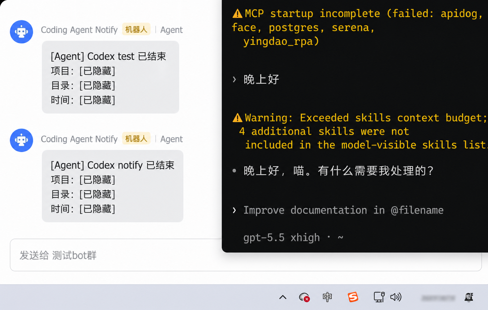
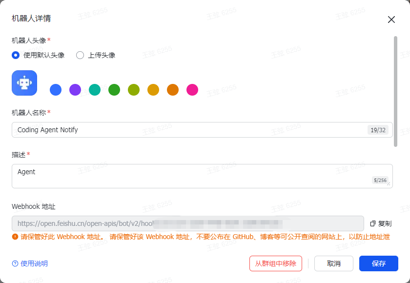

# agent-notify

Claude Code 和 Codex 的本地完成通知器。  
任务结束后自动发飞书消息，不占用 agent 上下文，不需要公网 IP，也不用在本机起 HTTPS 服务。

当前只做飞书。Telegram、企业微信以后可以继续加。

## 效果

配置成功后，飞书群会收到类似这样的消息：



```text
[Agent] Codex test 已结束
项目: agent-notify
目录: D:\agent-notify
时间: 04/26 20:43
```

日常使用时不是你一发消息就通知，而是 Codex / Claude Code 回答完一轮后通知。

## 原理

```text
Codex / Claude Code 完成一轮
        |
        v
CLI 触发本地 hook / notify
        |
        v
node D:\agent-notify\notify.mjs
        |
        v
飞书群机器人 webhook
```

通知逻辑在模型外面运行，所以不会把“发通知”这件事塞进 Codex 或 Claude Code 的上下文。

## 准备飞书机器人

机器人配置界面大概长这样，复制里面的 `Webhook 地址` 即可：



1. 打开飞书。
2. 进入你要收通知的群。
3. 点群设置里的 `群机器人`。
4. 点 `添加机器人`。
5. 选择 `自定义机器人`。
6. 名字可以填 `Agent Notify`。
7. 安全设置选 `自定义关键词`。
8. 关键词填：

```text
Agent
```

9. 复制飞书给你的 webhook 地址，格式类似：

```text
https://open.feishu.cn/open-apis/bot/v2/hook/xxxx
```

不要把真实 webhook 提交到 git。

## 安装

打开 PowerShell：

```powershell
cd D:\agent-notify
.\install.ps1 -FeishuWebhookUrl "这里换成你的飞书 webhook"
```

如果你的机器人开启了签名校验：

```powershell
.\install.ps1 `
  -FeishuWebhookUrl "这里换成你的飞书 webhook" `
  -FeishuWebhookSecret "这里换成飞书给你的签名密钥"
```

安装器会做这些事：

- 写入 `D:\agent-notify\config.json`
- 给 Claude Code 添加 `Stop` / `Notification` / `TaskCompleted` hooks
- 包装 Codex 的 `notify = [...]`
- 保留原来的 Codex notify，并在发送飞书后继续调用它

## 测试

先检查配置：

```powershell
node D:\agent-notify\notify.mjs doctor
```

看到下面这样就说明 webhook 已写入：

```text
config: ok
enabled: on
feishu: on
feishu.mode: webhook
feishu.webhookUrl: set
```

发送一条测试通知：

```powershell
node D:\agent-notify\notify.mjs test
```

看到：

```text
OK
```

然后去飞书群看消息。

## 测试 Codex 自动通知

重新打开一个 PowerShell，让 Codex 重新读取配置：

```powershell
codex exec "只回复：Codex 自动通知测试完成"
```

Codex 结束后，飞书应该收到一条 Codex 通知。

交互式也可以：

```powershell
codex
```

注意：安装前已经打开的 Codex 会话通常不会重新加载配置。要新开一个 Codex。

## 测试 Claude Code 自动通知

重新打开一个 PowerShell：

```powershell
claude -p "只回复：Claude 自动通知测试完成"
```

Claude 结束后，飞书应该收到一条 Claude Code 通知。

交互式也可以：

```powershell
claude
```

同样需要新启动 Claude Code 进程。

## 开关

编辑：

```text
D:\agent-notify\config.json
```

全部关闭：

```json
"enabled": false
```

只关 Claude：

```json
"agents": {
  "claude": false,
  "codex": true
}
```

只关 Codex：

```json
"agents": {
  "claude": true,
  "codex": false
}
```

只关飞书：

```json
"feishu": {
  "enabled": false
}
```

## 卸载

```powershell
cd D:\agent-notify
.\uninstall.ps1
```

卸载器会移除 Claude Code hooks，并恢复安装前的 Codex notify。

## 常见问题

### doctor 里 feishu.webhookUrl 还是 empty

重新安装一次：

```powershell
cd D:\agent-notify
.\install.ps1 -FeishuWebhookUrl "你的飞书 webhook"
node D:\agent-notify\notify.mjs doctor
```

### test 显示 OK，但飞书没消息

检查飞书机器人安全设置。关键词必须能匹配消息内容，推荐填：

```text
Agent
```

### 当前 Codex 窗口为什么不通知

安装 hook 前已经启动的 Codex / Claude Code 进程不一定重新加载配置。关闭旧窗口，重新打开再试。

### Claude Code 需要单独建机器人吗

不需要。一个飞书机器人可以同时接 Codex 和 Claude Code。消息里会区分来源。
